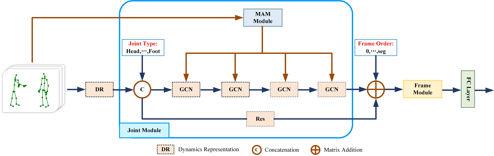

# Interactive Semantics Neural Network for Skeleton-Based Human Interaction Recognition (ISNN)

## Introduction

Skeleton-based human action recognition has attracted great interest thanks to the easy accessibility of the human skeleton data. Recently, there is a trend of using very deep feedforward neural networks to model the 3D coordinates of joints without considering the computational efficiency. In this work, we propose a simple yet effective semantics-guided neural network (ISNN). We explicitly introduce the high level semantics of joints (joint type and frame index) into the network to enhance the feature representation capability. Intuitively, semantic information, i.e., the joint type and the frame index, together with dynamics (i.e., 3D coordinates) reveal the spatial and temporal configuration/structure of human body joints and are very important for action recognition.
In addition, we exploit the relationship of joints hierarchically through two modules, i.e., a joint-level module for modeling the correlations of joints in the same frame and a frame-level module for modeling the dependencies of frames by taking the joints in the same frame as a whole. A strong baseline is proposed to facilitate the study of this field. With an order of magnitude smaller model size than most previous works, ISNN achieves the state-of-the-art performance.
 

## Framework


Figure 1: Framework
Overall network structure of ISNN. It includes joint module, frame module, and MAM module. In DR, we characterize joint information as dynamic features. We will merge two types of semantics, namely joint index and frame order, into the joint level module and before the frame level module, respectively.
We calculated the interactive semantic information through the MAM module, and fused and transmitted the interactive semantic information using a four layer residual GCN. Output through the FC layer after calculation by the frame level module.

## Prerequisites
The code is built with the following libraries:
- Python 3.8
- [Anaconda](https://www.anaconda.com/)
- [PyTorch](https://pytorch.org/) 1.13

## Data Preparation

We use the dataset of NTU60 RGB+D as an example for description. We need to first dowload the [NTU-RGB+D](https://github.com/shahroudy/NTURGB-D) dataset.

- Extract the dataset to ./data/ntu/nturgb+d_skeletons/
- Process the data
```bash
 cd ./data/ntu
 # Get skeleton of each performer
 python get_raw_skes_data.py
 # Remove the bad skeleton 
 python get_raw_denoised_data.py
 # Transform the skeleton to the center of the first frame
 python seq_transformation60.py
```
We use the dataset of NTU120 RGB+D as an example for description. We need to first dowload the [NTU-RGB+D 120](https://github.com/shahroudy/NTURGB-D) dataset.

- Extract the dataset to ./data/ntu/nturgb+d_skeletons/
- Process the data
```bash
 cd ./data/ntu
 # Get skeleton of each performer
 python get_raw_skes_data.py
 # Remove the bad skeleton 
 python get_raw_denoised_data.py
 # Transform the skeleton to the center of the first frame
 python seq_transformation120.py
```


## Training

```bash
# For the CS setting
python  main.py --network ISNN --dataset NTU --train 1 --case 0 --seg 10
# For the CV setting
python  main.py --network ISNN --dataset NTU --train 1 --case 1 --seg 10
# For the CSet setting
python  main.py --network ISNN --dataset NTU120 --train 1 --case 0 --seg 90
# For the CSub setting
python  main.py --network ISNN --dataset NTU120 --train 1 --case 1 --seg 90
```

## Testing

- Test the pre-trained models (./results/NTU/ISNN/)
```bash
# For the CS setting
python  main.py --network ISNN --dataset NTU --train 0 --case 0 --seg 10
# For the CV setting
python  main.py --network ISNN --dataset NTU --train 0 --case 1 --seg 10
# For the CSet setting
python  main.py --network ISNN --dataset NTU120 --train 0 --case 0 --seg 90
# For the CSub setting
python  main.py --network ISNN --dataset NTU120 --train 0 --case 1 --seg 90
```
